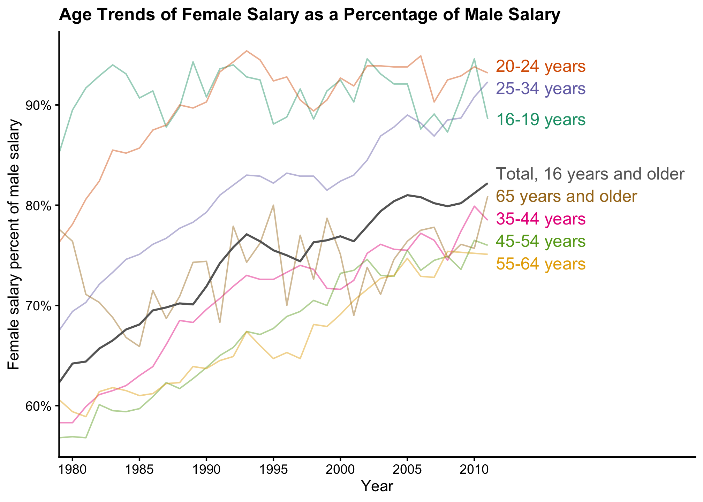
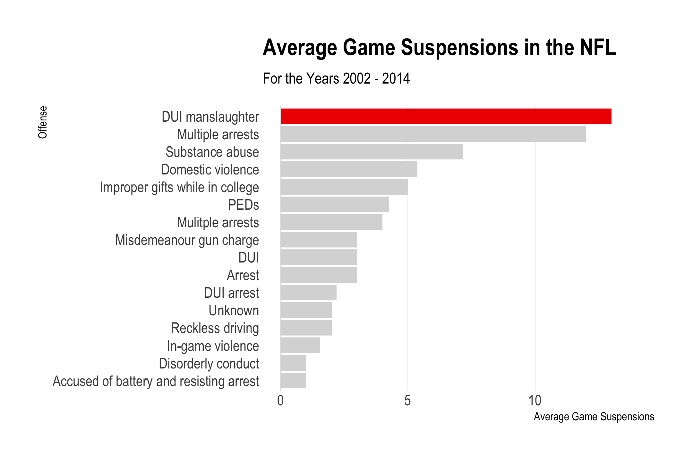

```{r setup, message=FALSE, warning=FALSE, include=FALSE}
library(metathis)

meta() %>%
  meta_description(
    'Showcase for Spring 2021 semester of EMSE course "Exploratory Data Analsis" at GWU'
  ) %>%
  meta_name("github-repo" = "emse-eda-gwu/2021-Spring") %>%
  meta_viewport() %>%
  meta_social(
    title = "eda.seas.gwu.edu",
    url = "https://eda.seas.gwu.edu/2021-Spring",
    image = "https://eda.seas.gwu.edu/images/eda_hex_sticker.png",
    image_alt = "Hex sticker for class logo showing Anscombe's quartet",
    og_type = "website",
    og_author = c("John Paul Helveston"),
    twitter_card_type = "summary",
    twitter_creator = "@JohnHelveston"
  )
```

<br>

<div class = "row"><div class = "col-md-5">

</div><div class = "col-md-7">
## [Would you get into an autonomous vehicle?](showcase/2021-Spring/av_future.html){target="_blank"}
by Leah Kaplan<br>
[<i class="fas fa-video"></i>](https://vimeo.com/544759088){target="_blank"}
</div></div>

<div class = "row"><div class = "col-md-5">

</div><div class = "col-md-7">
## [EV Market Protectionism in China](showcase/2021-Spring/china_ev_protectionism.html){target="_blank"}
by Lujin Zhao<br>
[<i class="fas fa-video"></i>](https://youtu.be/IcTFEs17CBs){target="_blank"}
</div></div>

<div class = "row"><div class = "col-md-5">

</div><div class = "col-md-7">
## [Electric Vehicle Forecasts in the US](showcase/2021-Spring/ev_forecasts.html){target="_blank"}
by Helena Rowe and Bridget Carl<br>
[<i class="fas fa-video"></i>](https://youtu.be/TeEiivtRvM4){target="_blank"}
</div></div>

<div class = "row"><div class = "col-md-5">

</div><div class = "col-md-7">
## [Should Money be able to buy Olympic Medals?](showcase/2021-Spring/gdp_olympics.html){target="_blank"}
by Izzy Doran, Omar Alkhadra, and Alejandro Medina<br>
[<i class="fas fa-video"></i>](https://youtu.be/BVmaDMFchNU){target="_blank"}
</div></div>

<div class = "row"><div class = "col-md-5">

</div><div class = "col-md-7">
## [Genders in the Workforce](showcase/2021-Spring/gender_pay_gap.html){target="_blank"}
by Alexa Rosdahl, Katie Fagan, and Gabriel Bahia De Sousa<br>
[<i class="fas fa-video"></i>](https://youtu.be/EYlvVw14ovA){target="_blank"}
</div></div>

<div class = "row"><div class = "col-md-5">

</div><div class = "col-md-7">
## [Lewis Hamilton: The Car or The Driver](showcase/2021-Spring/lewis_hamilton_car_or_driver.html){target="_blank"}
by Matthew Perlow, Omar Al-za’atreh, and Cooper May<br>
[<i class="fas fa-video"></i>](https://youtu.be/90cFriv_65I){target="_blank"}
</div></div>

<div class = "row"><div class = "col-md-5">

</div><div class = "col-md-7">
## [Global Climate Impact: An Exploration of Nations’ Contributions to Climate Change](showcase/2021-Spring/national_co2_emissions.html){target="_blank"}
by Carolyne Im, Kaveena Patel, and David Rosenberg<br>
[<i class="fas fa-video"></i>](https://youtu.be/9c761LfbvYM){target="_blank"}
</div></div>

<div class = "row"><div class = "col-md-5">

</div><div class = "col-md-7">
## [NFL Suspensions](showcase/2021-Spring/nfl_suspensions.html){target="_blank"}
by Ebunoluwa Akinbode, Kyara McDowell, and Kareemot Siyanbola<br>
[<i class="fas fa-video"></i>](https://www.youtube.com/watch?v=7bMQfF2nLAU){target="_blank"}
</div></div>

<div class = "row"><div class = "col-md-5">

</div><div class = "col-md-7">
## [Poverty and its Implications on Energy Use and  Carbon Emissions](showcase/2021-Spring/poverty_emissions.html){target="_blank"}
by Kazi Asifa Ashrafi, Michael O’Keefe, and Eliese Ottinger<br>
[<i class="fas fa-video"></i>](https://drive.google.com/file/d/1_mUYCkuEL8iRvjuTYqVKXFRCPlafy180/view){target="_blank"}
</div></div>

